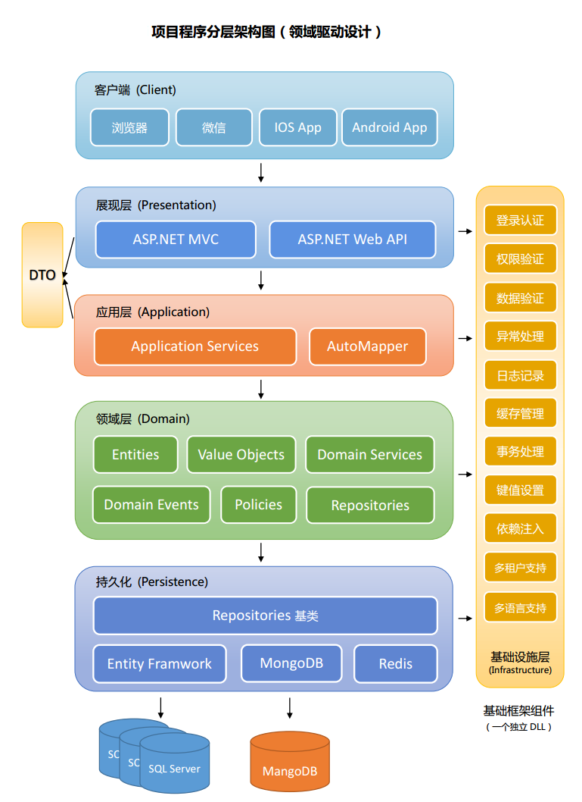

# 开发指南 （2020-05-16）
更好的管理项目，更好的上手项目，更好的交接项目

### 站点展现层结构
- `wwwroot` 目录
    - 对公的静态资源目录
- `wwwroot/css` 目录
    - 所有页面的样式根目录
    - 全部小写
    - `global.css` 全局样式
    - 页面样式存放格式：`{controller}/{action}.css`，如：`/home/index.css`
- `wwwroot/images` 目录
    - 所有页面的图片根目录
- `wwwroot/js` 目录
    - 所有页面的脚本根目录
    - 全部小写
    - `global.js` 全局脚本
    - 页面脚本存放类似 css 结构
    - 页面样式存放格式：`{controller}/{action}.js`，如：`/home/index.js`
- `wwwroot/lib` 目录
    - 公共组件根目录
    - 如引用的 jquery 包，jquery/xxx.js
    - 相同的组件不同的版本方于一个目录下，如 jquery/jquery-1.0.js、jquery/jquery-2.0.js
    - 组件尽量提取 dist 文件，如示例、map、主题、语言包等尽量不引入（只保留必要的项）
- `wwwroot/upload` 目录
    - 上传文件根目录
    - 上传的文件需要分类，即 `upload` 目录下不能直接存放文件
    - 常用列举：
    - `temp` 目录，所有临时文件存放，如导入的文件、导出的文件，可随时清空 `temp` 目录
    - `template` 目录，模版，如打印模版，导入模版
    - `docs` 目录，上传的文档，如上传接口可实现类似的存储：`/docs/2019/05/id.docx`，视具体情况
    - 切记所有文件放在同一目录的情况，根据需求分析拆分子文件存储
    - 为方便负载均衡等应用，使用文件时，配置服务器地址 + 文件路径的方式，如 `static.domain.com` + `/upload/docs/2019/05/id.docx`
- `Components` 目录
    - 组件
- `Controllers` 目录
    - 控制器，对应系统一级菜单
    - 搭建项目时，根据一级菜单创建控制器
    - 当出现新的功能模块，商讨是否需要新建控制器
    - 控制器采用大驼峰命名，如 `AccountController`；简写可全大写，如 API
    - 根据功能模块中文名，翻译对应的英文名称
    - 控制器类须添加注释说明
- `Filters` 目录
    - 过滤器
    - 如 授权访问，日记记录等
- `logs` 目录
    - 日志
    - 错误日志，调试日志，路径如：`2019/20190515.log`，视具体情况，但 `2019` 即按年分子路径是必要的
    - 避免单一日志文件过大，避免某一目录文件数量过多的情况
- `Views` 目录
    - 视图
    - 控制器对应的文件夹，文件夹下包含所有的 `Action` 页面
    - `Action` 保持大驼峰命名，如 `Index`
    - 每一个 `Action` 必须有注释描述
    - 如该控制器下有公共的局部视图，创建 `_PartialXXXX.cshtml`，以 `_Partial` 开头
- `Views/Shared` 目录
    - 公共视图
    - `_Partial` 开头的全局局部视图
- `appsettings.json` 文件
    - 配置文件
    - 每项须带有注释
    - 按分类

### 数据库及项目
- 数据库设计，推荐 `PD`，或自带设计工具
- 表名大驼峰命名，不带符号（下划线、横杠等）
- 按分类表名前缀保持一致，如：系统表：`SysUser`、`SysRole`、`SysLog`
- 表名根据中文翻译，不能使用拼音
- 表字段根据中文翻译，不能使用拼音
- 表和表字段必须带有注释，主键可忽略，表示键的字段，要描述清楚，如：`性别（1：男；2：女）`
- 主键统一采用 `GUID` 的字符串，数据库类型为字符串；特殊要求例外
- 不推荐主外键关联；特殊要求例外
- 不推荐写视图；特殊要求例外
- 不推荐写存储过程；特殊要求例外
- 表索引创建，评估设置字段为聚集索引、非聚集索引
- vs 对项目代码改写推荐，执行，特定情况例外
- vs 对项目不需要的 using 提示，删除
- vs 对项目不需要的变量提示，删除
- 所有的 `Action` 需有注释描述；所有类方法必须有注释，关键的地方有注释； 
- 一个方法处理多个复杂的逻辑，需按点依次描述
- 一般无须异常处理，全局过滤器会记录异常日志；某些情况需自己异常处理，应尽量输出异常日志
- `JS` 脚本，所有的方法必须有关键的注释；减少全局变量的声明，减少同一作用域的变量声明，过多会导致冲突、烦杂
- 所有的方法必须仅有一行间隔，Action、类库方法、JS 函数等
- 空一行，一般表示拉开区块，代码美观，类似一段话的逗号分割
- 空两行，一般表示分层，类似一段话的分号分割
- 与项目整体代码风格保持一致，不要突出自己的代码风格
- 方法参数，小驼峰优先
- 项目的构建命名推荐 `Aaa.Bbb` 的形式，如 `Volo.Abp`
- 代码解耦，功能细分化，可提高利用率，方便更好的维护升级
- 优先采用 `LINQ`，复杂的功能、不支持 `LINQ` 的一些查询，可采用 `SQL` 查询字符串处理（须防注入）
- 跨平台，增强移植性：能很方便的切换数据库、能很方便的切换部署环境